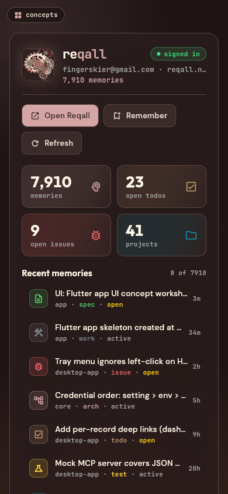
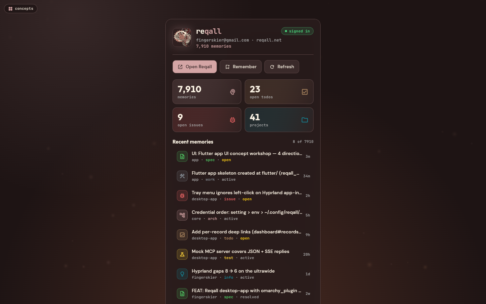
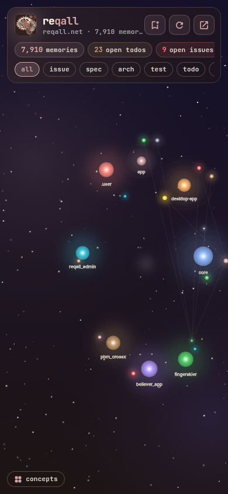
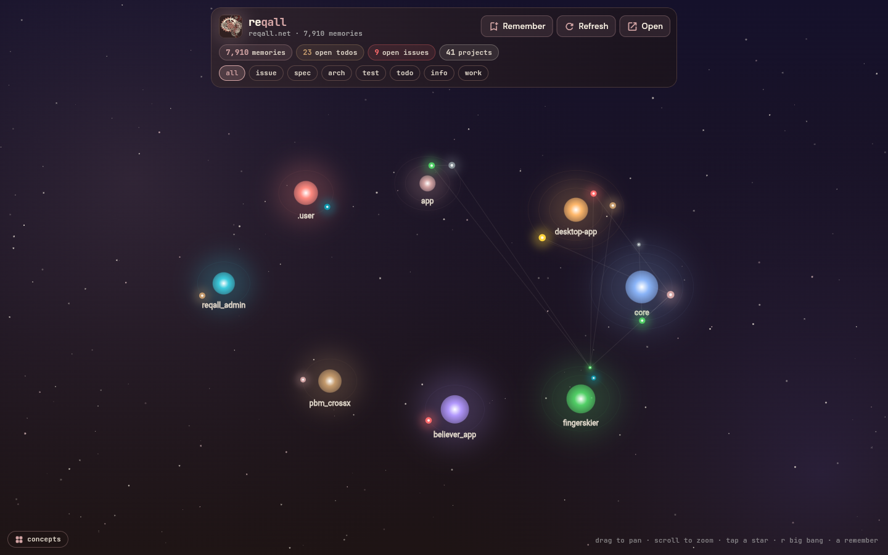
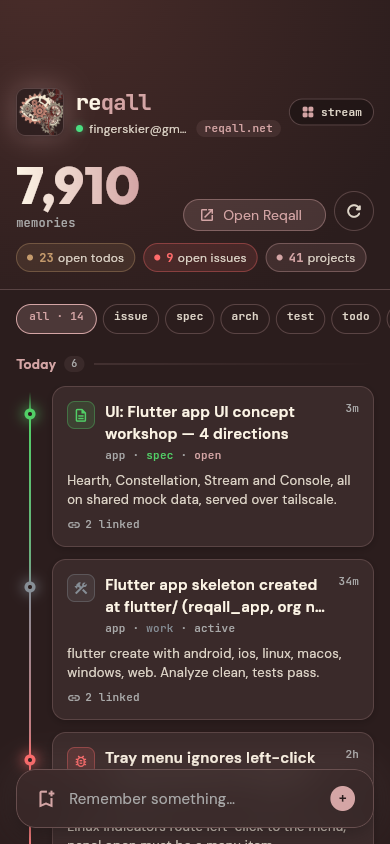
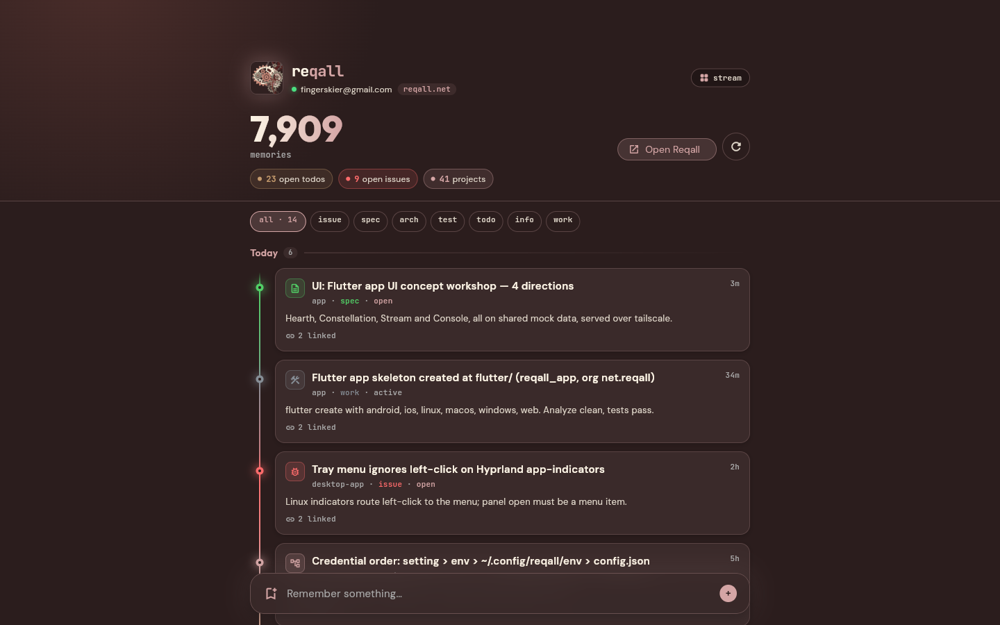
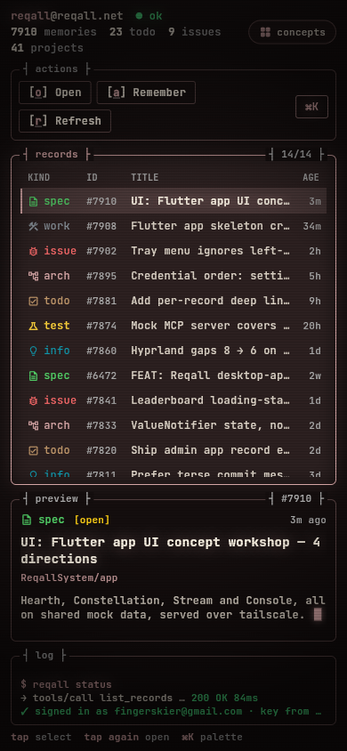
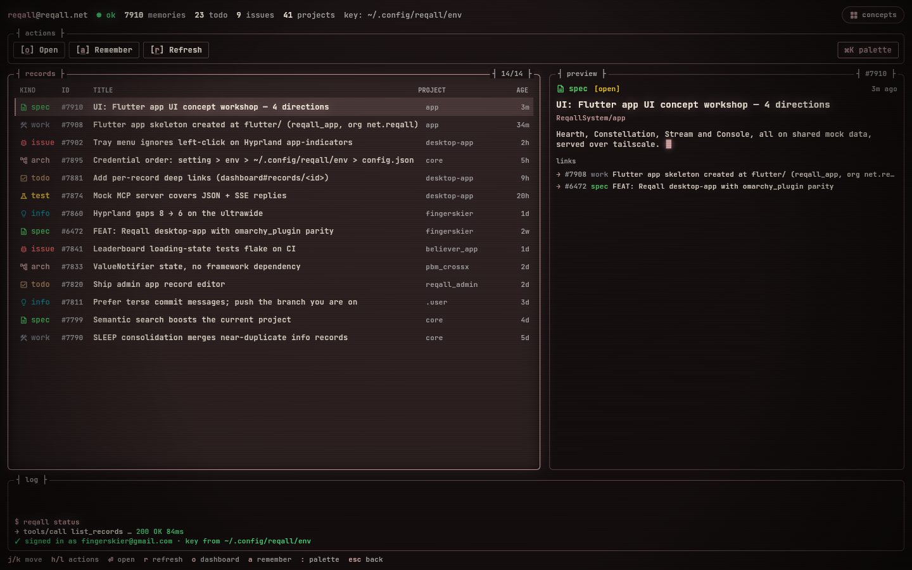

# Reqall UI designs

The four directions workshopped for the Flutter app (October 2026), kept as a
small web-only Flutter project so they stay runnable. **Stream** was chosen
and now lives in `../flutter` as the app's home screen; this gallery is the
reference copy and is not kept in sync with the app.

All four carry the omarchy plugin panel's feature set (hero with sign-in
state and memory count, Open / Remember / Refresh, usage stats, recent
memories, the Remember form) on the same mock account, in the reqall.net
palette with Outfit, DM Sans and JetBrains Mono.

| | Phone | Desktop |
|---|---|---|
| **01 Hearth**: the panel, polished. Ember background, breathing mark, rolling counters, panel keys (j/k/h/l/⏎/r/o/a), Remember sheet; tap the auth pill to preview signed-out/error states. |  |  |
| **02 Constellation**: projects as suns, memories orbiting by kind, links as threads. Pan/zoom, tap for details, kind filters, "big bang" refresh. |  |  |
| **03 Stream** (chosen): timeline under sticky day headers on a kind-blended rail. Swipe right resolves, left archives (undo); tap expands; frosted capture bar opens Remember. |  |  |
| **04 Console**: keyboard-first TUI: CRT scanlines, box-drawn panes, ⌘K / `:` palette with fuzzy match, typed-out MCP log; everything also tappable. |  |  |

## Layout

- `lib/main.dart`: the concept picker (`/`) and a route per concept (`/#/hearth`, `/#/constellation`, `/#/stream`, `/#/console`)
- `lib/concepts/`: one file per concept
- `lib/shared/`: palette and kinds (`theme.dart`), mock data shaped like the plugin's MCP reads (`mock.dart`), shared widgets including the Remember form (`widgets.dart`)
- `test/`: renders every concept at 390×844 and 1440×900 and fails on any layout exception

## Run

```sh
flutter run -d chrome                     # local
flutter build web --release               # then serve build/web, e.g.
python3 -m http.server 8686 --bind <tailscale-ip> -d build/web
```

Fonts come from Google Fonts at runtime (`google_fonts` 9, which builds on
`package:material_ui`: give `ThemeData` a `fontFamily`, not a google_fonts
`TextTheme`).
