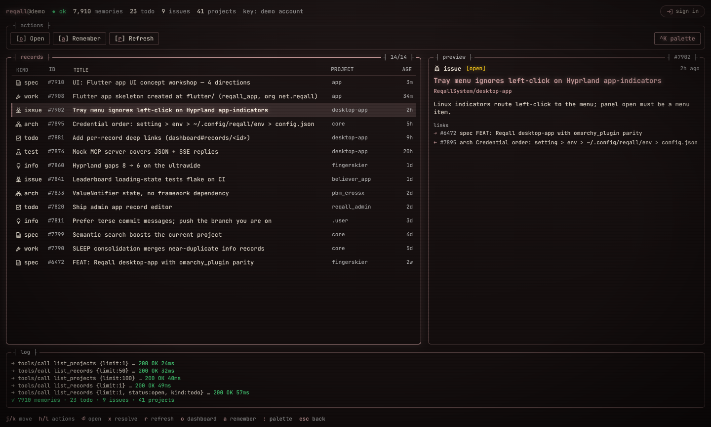
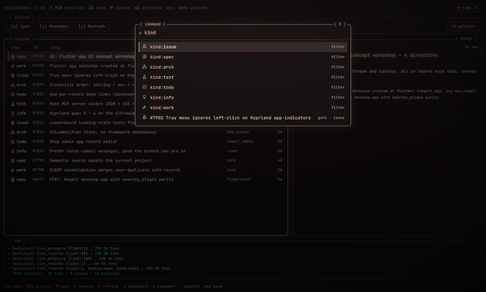
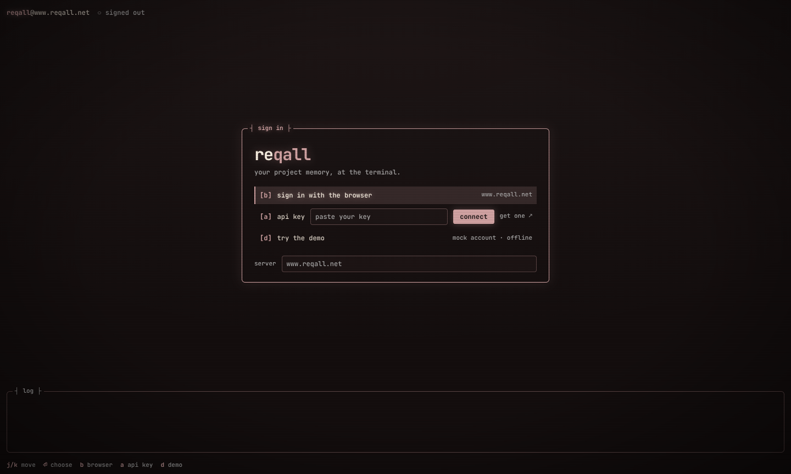
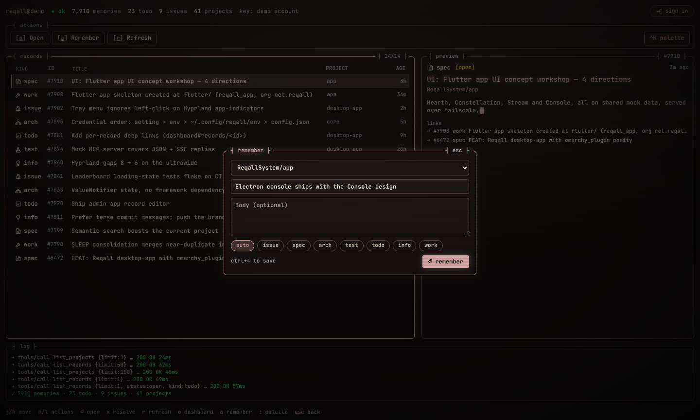

# Reqall Console

The Reqall desktop app as a keyboard-first terminal: the **Console** design
from `../designs` (concept 04), on the live Reqall API. It signs in, reads
and writes the same way as the Flutter app in `../flutter`.

| | |
|---|---|
|  |  |
|  |  |

## Using it

- **Status line**: host, sync state (`● ok`, `● paused` on 403, `● offline`), memories / open todos / open issues / projects, and where the key came from.
- **Records**: newest first, 50 at a time; scrolling or `j` near the end loads more. Filters (`kind:`, `project:`) run on the server.
- **Preview**: body and links of the selected record. Enter on a link that is not in the list peeks at it; `esc` goes back.
- **Log**: every request the app makes, typed out as it happens. Detail fetches only show up when they fail.
- **Palette** (`:`, `/`, `⌘K` / `Ctrl+K`): fuzzy over actions, `resolve` / `reopen` / `archive` for the selection, `kind:*`, `project:*`, and `#id` goto.
- **Remember** (`a`): project, title, optional body, kind or auto. `Ctrl+Enter` saves.

| Key | | Key | |
|---|---|---|---|
| `j` / `k` | move | `r` | refresh |
| `h` / `l` | across the actions | `o` | open the dashboard |
| `⏎` | activate / open the record | `a` | remember |
| `x` | resolve (or reopen) | `:` `/` `⌘K` | palette |
| `esc` | back: peek, then filters | | |

Everything is also clickable: click selects a row, a second click opens it.

## Signing in

- **Browser** (OAuth 2.1 + PKCE): the system browser signs in and redirects to a one-shot listener on `127.0.0.1`. Tokens refresh on expiry or a 401.
- **CLI login**: credentials another Reqall client left on this machine, in order `REQALL_API_KEY`, `~/.config/reqall/env` (parsed, never sourced), then the CLI's `config.json`. Used as they are and never refreshed, so the CLI's token is not rotated out from under it.
- **API key**: paste one from the dashboard.
- **Demo**: the mock account from the design workshop; nothing leaves the machine.

Credentials are encrypted with the OS keychain through Electron's
`safeStorage` (Keychain, DPAPI, or the Secret Service on Linux: the app asks
for `gnome-libsecret`, so it works on Hyprland and other non-GNOME desktops).
Without a keychain nothing is written and the sign-in lasts until you quit;
the sign-in screen says so.

## Layout

- `src/main/index.js`: app lifecycle, window, menu, keychain
- `src/main/bridge.js`: session ⇄ renderer over IPC (arguments are coerced; the renderer is not trusted)
- `src/main/session.js`: sign-in state, data, token refresh, filters, optimistic writes, the request log
- `src/main/mcp.js`: JSON-RPC `tools/call` to `/mcp`, JSON or SSE replies, at most 4 in flight, 429s retried
- `src/main/repository.js`, `demo.js`: live and mock data behind the same methods
- `src/main/credentials.js`, `oauth.js`: credential discovery and storage, PKCE and the loopback redirect
- `src/preload.cjs`: the `window.reqall` bridge (context isolation, sandbox, no Node in the page)
- `src/renderer/`: the console itself, plain HTML/CSS/JS with a strict CSP and bundled JetBrains Mono
- `src/shared/model.js`: kinds, ages, fuzzy match, log formatting

## Develop

```sh
npm install
npm start            # the app
npm test             # node:test: MCP client, auth, session against a local fake server
npm run screenshots  # renders the demo offscreen into screenshots/ (no display needed)
npm run pack         # unpacked build in dist/; npm run build for AppImage / tar.gz / dmg / exe
```

On Hyprland the window tiles like any other; add a window rule for class
`reqall-console` to float it.
